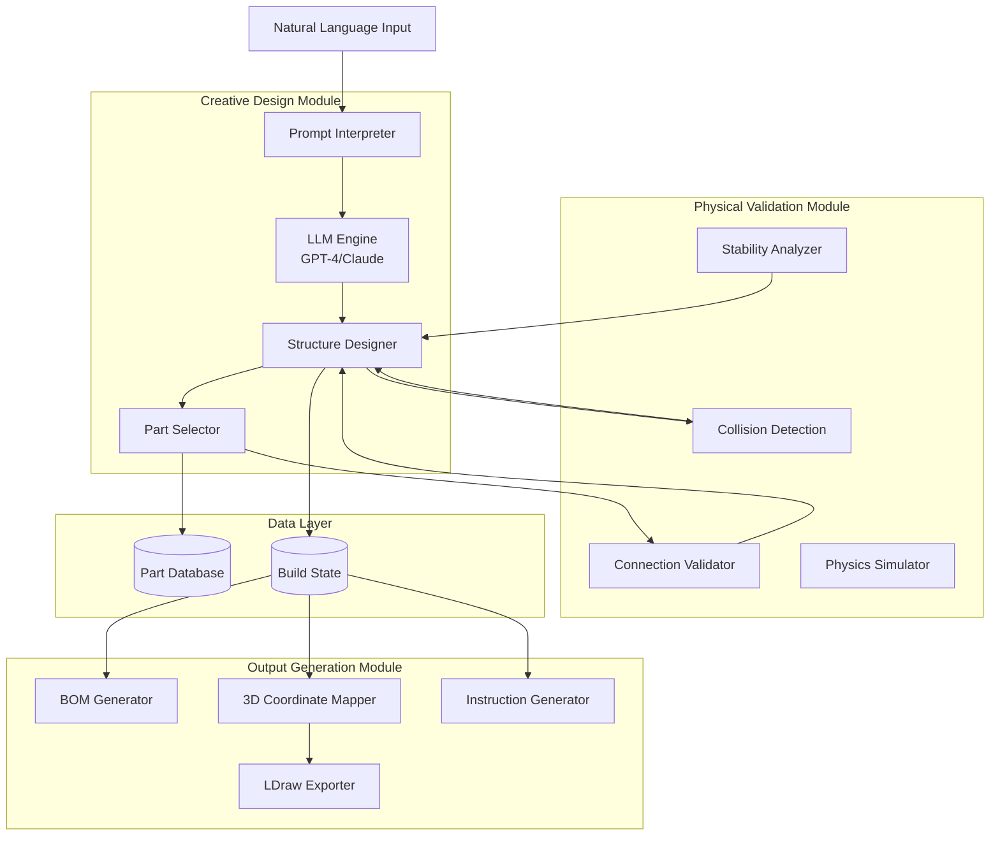

# Lego Architect - Architecture Discussion

## Project Overview

**Goal**: Natural language prompt → LEGO build with BOM, 3D coordinates, and assembly instructions

**Example Input**: "A small red spaceship"

**Required Outputs**:
1. **Bill of Materials (BOM)**: List of parts with quantities and colors
2. **3D Coordinate Map**: Exact placement of each brick in 3D space
3. **Step-by-Step Instructions**: Ordered assembly sequence

---

## Table of Contents

1. [Coordinate System & Grid Representation](#1-coordinate-system--grid-representation)
2. [LDraw Integration Strategy](#2-ldraw-integration-strategy)
3. [Module Architecture](#3-module-architecture)
4. [Data Structures](#4-data-structures)
5. [Design Decisions & Tradeoffs](#5-design-decisions--tradeoffs)
6. [Implementation Roadmap](#6-implementation-roadmap)

---

## 1. Coordinate System & Grid Representation

### 1.1 LEGO Physical Dimensions

LEGO uses a precise measurement system:

```
1 stud width = 8mm (physical)
1 brick height = 9.6mm (physical)
1 plate height = 3.2mm (physical)

Ratio: brick:plate = 3:1
Ratio: 5 plates = 1.67 bricks (5 × 3.2 = 16mm vs 1.67 × 9.6 = 16.032mm)
```

**The 5:6 Ratio**: 5 plates = 6 LDraw height units (in LDU system)

### 1.2 LDraw Units (LDU)

LDraw is the de facto standard for LEGO CAD. It uses **LDraw Units (LDU)**:

```
1 stud = 20 LDU (x/y plane)
1 brick height = 24 LDU (z axis)
1 plate height = 8 LDU (z axis)

Therefore:
- 3 plates = 24 LDU = 1 brick height ✓
- 5 plates = 40 LDU
```

**LDU Coordinate System**:
- **X-axis**: Left (-) to Right (+)
- **Y-axis**: Top (-) to Bottom (+) [Note: Y is inverted!]
- **Z-axis**: Back (-) to Front (+)

```
       Y (height)
       |
       |_____ X (width)
      /
     /
    Z (depth)

Origin (0,0,0) is typically at the top-left-back corner
```

### 1.3 Proposed Grid Representation

I recommend **three coordinate systems** working together:

#### Option A: Stud Grid + LDU (Hybrid - RECOMMENDED)

```python
class CoordinateSystem:
    """
    Hybrid coordinate system for LEGO builds

    - Stud Grid: Integer coordinates for placement logic
    - LDU: Precise rendering coordinates for LDraw export
    """

    # Stud grid (integer coordinates)
    stud_x: int  # Studs in X direction
    stud_z: int  # Studs in Z direction
    plate_y: int # Plates in Y direction (height)

    # LDU conversion
    @property
    def ldu_x(self) -> float:
        return self.stud_x * 20.0

    @property
    def ldu_y(self) -> float:
        return self.plate_y * 8.0

    @property
    def ldu_z(self) -> float:
        return self.stud_z * 20.0

    @property
    def brick_height(self) -> float:
        """Height in brick units (1 brick = 3 plates)"""
        return self.plate_y / 3.0
```

**Why Hybrid?**
- **Stud Grid**: Easy for AI/LLM to reason about ("place a 2×4 brick at position (5, 2, 0)")
- **Plate Heights**: Natural for vertical stacking (plates are the atomic unit)
- **LDU**: Direct conversion to LDraw format for rendering

#### Example Placement

```python
# A 2×4 brick (part 3001) at position
brick = Part(
    part_id="3001",  # 2×4 brick
    color=4,         # Red
    position=StudCoordinate(
        stud_x=0,    # Left edge
        stud_z=0,    # Back edge
        plate_y=0    # Bottom layer
    ),
    dimensions=PartDimensions(
        studs_width=2,
        studs_length=4,
        plates_height=3  # 1 brick = 3 plates
    )
)

# Converts to LDU for LDraw export:
# Position: (0, 0, 0) in LDU
# Matrix: [1 0 0 0 1 0 0 0 1] (no rotation)
```

### 1.4 Handling the 5:6 Ratio

The 5:6 ratio is already handled by LDraw's design:
- **5 plates** = 40 LDU (5 × 8)
- This maintains proper physical proportions

**Key Insight**: We don't need to manually manage this ratio if we use LDU consistently. The ratio is baked into the LDU standard.

```python
# Plate height in LDU
PLATE_HEIGHT_LDU = 8

# Brick height in LDU (3 plates)
BRICK_HEIGHT_LDU = 24  # = 3 × 8

# 5 plates
FIVE_PLATES_LDU = 40   # = 5 × 8

# This automatically maintains the 5:6 ratio relative to brick widths
```

---

## 2. LDraw Integration Strategy

### 2.1 LDraw Part Library Overview

**LDraw** is an open standard with:
- **45,000+ parts** in the official library
- **Standard format**: Plain text files (`.dat`)
- **Part metadata**: Dimensions, connection points, geometry
- **Colors**: 200+ official LEGO colors

**LDraw File Structure**:
```
ldraw/
├── parts/          # Individual part files
│   ├── 3001.dat    # 2×4 brick
│   ├── 3002.dat    # 2×3 brick
│   └── ...
├── p/              # Primitives (studs, cylinders, etc.)
└── parts.lst       # Master index
```

### 2.2 Parsing LDraw Parts

**LDraw Part File Format** (`.dat`):

```ldraw
0 Brick 2 x 4
0 Name: 3001.dat
0 Author: James Jessiman
0 !LDRAW_ORG Part UPDATE 2024-01

1 16 0 0 0 1 0 0 0 1 0 0 0 1 stud4.dat
1 16 0 4 0 1 0 0 0 1 0 0 0 1 stud4.dat
4 16 -20 0 -40 20 0 -40 20 0 40 -20 0 40
...
```

**Line Type Meanings**:
- `0`: Comment/metadata
- `1`: Sub-file reference (e.g., studs)
- `3`: Triangle
- `4`: Quadrilateral
- `5`: Optional line

### 2.3 Python Libraries for LDraw

#### Option 1: `pylddlib` (Simple parsing)
```python
# Basic LDraw file parsing
from pylddlib import LDrawFile

ldraw_file = LDrawFile("path/to/model.ldr")
for part in ldraw_file.parts:
    print(f"Part: {part.name}, Color: {part.color}, Position: {part.position}")
```

#### Option 2: Custom Parser (RECOMMENDED for control)

```python
import re
from dataclasses import dataclass
from typing import List, Tuple

@dataclass
class LDrawPartMeta:
    """Metadata from LDraw part file"""
    part_id: str
    name: str
    category: str
    dimensions: Tuple[int, int, int]  # studs_width, studs_length, plates_height
    connection_points: List[Tuple[float, float, float]]  # Stud positions

class LDrawParser:
    """Parse LDraw part library"""

    def __init__(self, ldraw_path: str):
        self.ldraw_path = ldraw_path
        self.parts_cache: Dict[str, LDrawPartMeta] = {}

    def load_part_metadata(self, part_id: str) -> LDrawPartMeta:
        """Load part dimensions and connection points"""
        part_file = f"{self.ldraw_path}/parts/{part_id}.dat"

        with open(part_file, 'r') as f:
            lines = f.readlines()

        name = self._parse_name(lines)
        dimensions = self._infer_dimensions(lines)
        connection_points = self._extract_studs(lines)

        return LDrawPartMeta(
            part_id=part_id,
            name=name,
            dimensions=dimensions,
            connection_points=connection_points
        )

    def _extract_studs(self, lines: List[str]) -> List[Tuple[float, float, float]]:
        """Extract stud positions from part file"""
        studs = []
        for line in lines:
            # Look for stud primitives (stud.dat, stud2.dat, etc.)
            if 'stud' in line.lower() and line.startswith('1'):
                parts = line.split()
                if len(parts) >= 5:
                    # Format: 1 color x y z ...
                    x, y, z = float(parts[2]), float(parts[3]), float(parts[4])
                    studs.append((x, y, z))
        return studs

    def _infer_dimensions(self, lines: List[str]) -> Tuple[int, int, int]:
        """Infer part dimensions from geometry"""
        # Parse all vertices and find bounding box
        vertices = []
        for line in lines:
            if line.startswith(('3', '4')):  # Triangles/quads
                parts = line.split()
                # Extract coordinates (every 3 values after color)
                coords = parts[2:]
                for i in range(0, len(coords), 3):
                    if i + 2 < len(coords):
                        vertices.append((
                            float(coords[i]),
                            float(coords[i+1]),
                            float(coords[i+2])
                        ))

        if not vertices:
            return (0, 0, 0)

        # Calculate bounding box
        xs, ys, zs = zip(*vertices)
        width_ldu = max(xs) - min(xs)
        height_ldu = max(ys) - min(ys)
        depth_ldu = max(zs) - min(zs)

        # Convert LDU to stud/plate units
        studs_width = round(width_ldu / 20)
        studs_length = round(depth_ldu / 20)
        plates_height = round(height_ldu / 8)

        return (studs_width, studs_length, plates_height)
```

### 2.4 Alternative: Pre-built Part Database

Instead of parsing `.dat` files at runtime, create a **JSON database**:

```json
{
  "parts": [
    {
      "id": "3001",
      "name": "Brick 2 x 4",
      "category": "brick",
      "dimensions": {
        "studs_width": 2,
        "studs_length": 4,
        "plates_height": 3
      },
      "connection_points": {
        "top": [
          {"x": -10, "y": 0, "z": -30},
          {"x": 10, "y": 0, "z": -30},
          {"x": -10, "y": 0, "z": -10},
          {"x": 10, "y": 0, "z": -10},
          {"x": -10, "y": 0, "z": 10},
          {"x": 10, "y": 0, "z": 10},
          {"x": -10, "y": 0, "z": 30},
          {"x": 10, "y": 0, "z": 30}
        ],
        "bottom": [
          {"x": 0, "y": 24, "z": 0}
        ]
      },
      "colors_available": [1, 4, 5, 14, 15],
      "ldraw_file": "3001.dat"
    }
  ]
}
```

**Approach**: Build this database once using a preprocessing script.

```python
# Preprocessing script (run once)
def build_part_database(ldraw_path: str, output_path: str):
    """Generate JSON database from LDraw library"""
    parser = LDrawParser(ldraw_path)
    database = {"parts": []}

    # Parse common parts (or all parts)
    common_parts = ["3001", "3002", "3003", "3004", ...]  # Top 500 parts

    for part_id in common_parts:
        try:
            meta = parser.load_part_metadata(part_id)
            database["parts"].append({
                "id": part_id,
                "name": meta.name,
                "dimensions": {
                    "studs_width": meta.dimensions[0],
                    "studs_length": meta.dimensions[1],
                    "plates_height": meta.dimensions[2]
                },
                "connection_points": {
                    "top": [{"x": p[0], "y": p[1], "z": p[2]}
                           for p in meta.connection_points]
                },
                "ldraw_file": f"{part_id}.dat"
            })
        except Exception as e:
            print(f"Failed to parse {part_id}: {e}")

    with open(output_path, 'w') as f:
        json.dump(database, f, indent=2)
```

---

## 3. Module Architecture

### 3.1 High-Level System Design



### 3.2 Module Interfaces

#### A. Creative Design Module

**Responsibilities**:
- Parse natural language prompts
- Generate high-level design concepts
- Select appropriate parts
- Create initial 3D layout

**Interface**:
```python
from typing import List, Optional
from dataclasses import dataclass

@dataclass
class DesignRequest:
    prompt: str
    constraints: Optional[dict] = None  # e.g., max_pieces, colors, size

@dataclass
class DesignProposal:
    structure_type: str  # "spaceship", "building", "vehicle"
    estimated_size: Tuple[int, int, int]  # studs (x, z, y)
    color_palette: List[int]
    parts_needed: List[str]  # part IDs
    confidence: float

class CreativeDesignModule:
    def __init__(self, llm_client, part_database):
        self.llm = llm_client
        self.parts_db = part_database

    async def generate_design(self, request: DesignRequest) -> DesignProposal:
        """Generate initial design from natural language"""
        pass

    async def create_layout(self, proposal: DesignProposal) -> 'BuildState':
        """Create 3D layout of parts"""
        pass

    def refine_design(self, build_state: 'BuildState',
                     feedback: 'ValidationResult') -> 'BuildState':
        """Refine design based on validation feedback"""
        pass
```

#### B. Physical Validation Module

**Responsibilities**:
- Check for part collisions (overlaps)
- Validate connections (studs align with anti-studs)
- Analyze structural stability
- Ensure physical feasibility

**Interface**:
```python
@dataclass
class ValidationResult:
    is_valid: bool
    errors: List[str]
    warnings: List[str]
    suggestions: List[str]

class PhysicalValidationModule:
    def validate_build(self, build_state: 'BuildState') -> ValidationResult:
        """Run all validation checks"""
        result = ValidationResult(is_valid=True, errors=[], warnings=[], suggestions=[])

        # Run checks
        collision_result = self.check_collisions(build_state)
        connection_result = self.validate_connections(build_state)
        stability_result = self.check_stability(build_state)

        # Aggregate results
        result.errors.extend(collision_result.errors)
        result.errors.extend(connection_result.errors)
        result.warnings.extend(stability_result.warnings)

        result.is_valid = len(result.errors) == 0

        return result

    def check_collisions(self, build_state: 'BuildState') -> ValidationResult:
        """Check if any parts overlap in 3D space"""
        pass

    def validate_connections(self, build_state: 'BuildState') -> ValidationResult:
        """Ensure parts are properly connected via studs"""
        pass

    def check_stability(self, build_state: 'BuildState') -> ValidationResult:
        """Analyze if structure will stand (center of gravity, support)"""
        pass
```

#### C. Output Generation Module

**Responsibilities**:
- Generate Bill of Materials
- Create 3D coordinate map
- Produce step-by-step instructions
- Export to LDraw format

**Interface**:
```python
@dataclass
class BillOfMaterials:
    parts: List[Tuple[str, int, int]]  # (part_id, color, quantity)
    total_pieces: int
    estimated_cost: Optional[float] = None

@dataclass
class AssemblyStep:
    step_number: int
    description: str
    parts_to_add: List['PlacedPart']
    camera_angle: Optional[dict] = None

class OutputGenerationModule:
    def generate_bom(self, build_state: 'BuildState') -> BillOfMaterials:
        """Create bill of materials from build state"""
        pass

    def generate_instructions(self, build_state: 'BuildState') -> List[AssemblyStep]:
        """Create step-by-step assembly instructions"""
        pass

    def export_ldraw(self, build_state: 'BuildState', output_path: str):
        """Export build to LDraw .ldr file"""
        pass
```

---

## 4. Data Structures

### 4.1 Core Data Structures

```python
from dataclasses import dataclass, field
from typing import List, Tuple, Optional
import numpy as np

@dataclass
class StudCoordinate:
    """Position in stud-grid coordinates"""
    stud_x: int
    stud_z: int
    plate_y: int  # Height in plates

    def to_ldu(self) -> Tuple[float, float, float]:
        """Convert to LDraw Units"""
        return (
            self.stud_x * 20.0,
            self.plate_y * 8.0,
            self.stud_z * 20.0
        )

    def __add__(self, other: 'StudCoordinate') -> 'StudCoordinate':
        return StudCoordinate(
            self.stud_x + other.stud_x,
            self.stud_z + other.stud_z,
            self.plate_y + other.plate_y
        )

@dataclass
class PartDimensions:
    """Part dimensions in LEGO units"""
    studs_width: int   # X dimension
    studs_length: int  # Z dimension
    plates_height: int # Y dimension

    def to_ldu(self) -> Tuple[float, float, float]:
        return (
            self.studs_width * 20.0,
            self.plates_height * 8.0,
            self.studs_length * 20.0
        )

@dataclass
class Rotation:
    """Rotation in 90-degree increments around Y-axis"""
    degrees: int = 0  # 0, 90, 180, 270

    def to_matrix(self) -> np.ndarray:
        """Convert to 3x3 rotation matrix for LDraw"""
        rad = np.radians(self.degrees)
        cos, sin = np.cos(rad), np.sin(rad)
        return np.array([
            [cos, 0, sin],
            [0, 1, 0],
            [-sin, 0, cos]
        ])

@dataclass
class PlacedPart:
    """A part instance placed in the build"""
    part_id: str              # e.g., "3001"
    color: int                # LDraw color code
    position: StudCoordinate  # Where it's placed
    rotation: Rotation        # How it's oriented
    dimensions: PartDimensions

    # Metadata
    layer: int = 0            # Building layer (for instructions)
    connected_to: List[int] = field(default_factory=list)  # IDs of parts below

    def get_bounding_box(self) -> Tuple[StudCoordinate, StudCoordinate]:
        """Get min/max coordinates of this part"""
        min_corner = self.position

        # Apply rotation to dimensions
        if self.rotation.degrees in [0, 180]:
            width, length = self.dimensions.studs_width, self.dimensions.studs_length
        else:  # 90 or 270
            width, length = self.dimensions.studs_length, self.dimensions.studs_width

        max_corner = StudCoordinate(
            self.position.stud_x + width,
            self.position.stud_z + length,
            self.position.plate_y + self.dimensions.plates_height
        )

        return (min_corner, max_corner)

    def get_stud_positions(self) -> List[StudCoordinate]:
        """Get positions of studs on top of this part"""
        studs = []
        min_c, max_c = self.get_bounding_box()

        # Studs are on top, at each stud position
        for x in range(min_c.stud_x, max_c.stud_x):
            for z in range(min_c.stud_z, max_c.stud_z):
                studs.append(StudCoordinate(x, z, max_c.plate_y))

        return studs

    def to_ldraw_line(self, part_id_counter: int) -> str:
        """Convert to LDraw file format line"""
        x, y, z = self.position.to_ldu()
        matrix = self.rotation.to_matrix().flatten()

        # LDraw format: 1 <color> <x> <y> <z> <a> <b> <c> <d> <e> <f> <g> <h> <i> <part>
        return f"1 {self.color} {x} {y} {z} " + \
               f"{matrix[0]} {matrix[1]} {matrix[2]} " + \
               f"{matrix[3]} {matrix[4]} {matrix[5]} " + \
               f"{matrix[6]} {matrix[7]} {matrix[8]} " + \
               f"{self.part_id}.dat"

@dataclass
class BuildState:
    """Complete state of the LEGO build"""
    parts: List[PlacedPart] = field(default_factory=list)

    # Metadata
    name: str = "Untitled Build"
    description: str = ""
    author: str = "AI Architect"

    # Spatial index for fast collision detection
    _occupancy_grid: Optional[np.ndarray] = None

    def add_part(self, part: PlacedPart) -> bool:
        """Add a part to the build (with validation)"""
        # Check if position is valid
        if self.check_collision(part):
            return False

        self.parts.append(part)
        self._update_occupancy_grid(part)
        return True

    def check_collision(self, new_part: PlacedPart) -> bool:
        """Check if new part collides with existing parts"""
        new_min, new_max = new_part.get_bounding_box()

        for existing_part in self.parts:
            ex_min, ex_max = existing_part.get_bounding_box()

            # Check AABB (Axis-Aligned Bounding Box) collision
            if self._aabb_overlap(new_min, new_max, ex_min, ex_max):
                return True

        return False

    def _aabb_overlap(self, min1: StudCoordinate, max1: StudCoordinate,
                     min2: StudCoordinate, max2: StudCoordinate) -> bool:
        """Check if two axis-aligned bounding boxes overlap"""
        return not (
            max1.stud_x <= min2.stud_x or max2.stud_x <= min1.stud_x or
            max1.stud_z <= min2.stud_z or max2.stud_z <= min1.stud_z or
            max1.plate_y <= min2.plate_y or max2.plate_y <= min1.plate_y
        )

    def get_dimensions(self) -> Tuple[int, int, int]:
        """Get overall dimensions of the build"""
        if not self.parts:
            return (0, 0, 0)

        all_corners = [part.get_bounding_box() for part in self.parts]

        min_x = min(min_c.stud_x for min_c, _ in all_corners)
        min_z = min(min_c.stud_z for min_c, _ in all_corners)
        min_y = min(min_c.plate_y for min_c, _ in all_corners)

        max_x = max(max_c.stud_x for _, max_c in all_corners)
        max_z = max(max_c.stud_z for _, max_c in all_corners)
        max_y = max(max_c.plate_y for _, max_c in all_corners)

        return (max_x - min_x, max_z - min_z, max_y - min_y)

    def _update_occupancy_grid(self, part: PlacedPart):
        """Update spatial index for fast collision detection"""
        # TODO: Implement 3D occupancy grid
        pass
```

### 4.2 Collision Detection Optimization

For better performance with many parts, use a **3D Occupancy Grid**:

```python
class OccupancyGrid:
    """3D grid for fast collision detection"""

    def __init__(self, size: Tuple[int, int, int]):
        """Initialize grid (in plate units)"""
        self.grid = np.zeros(size, dtype=bool)

    def mark_occupied(self, min_corner: StudCoordinate, max_corner: StudCoordinate):
        """Mark cells as occupied"""
        self.grid[
            min_corner.stud_x:max_corner.stud_x,
            min_corner.stud_z:max_corner.stud_z,
            min_corner.plate_y:max_corner.plate_y
        ] = True

    def is_occupied(self, min_corner: StudCoordinate, max_corner: StudCoordinate) -> bool:
        """Check if any cells are occupied"""
        region = self.grid[
            min_corner.stud_x:max_corner.stud_x,
            min_corner.stud_z:max_corner.stud_z,
            min_corner.plate_y:max_corner.plate_y
        ]
        return np.any(region)
```

---

## 5. Design Decisions & Tradeoffs

### 5.1 Language Choice: Python vs TypeScript

| Aspect | Python | TypeScript |
|--------|--------|------------|
| **ML/AI Libraries** | ✅ Excellent (PyTorch, TF, transformers) | ❌ Limited |
| **LLM Integration** | ✅ Native (OpenAI, Anthropic SDKs) | ✅ Good |
| **3D Math** | ✅ NumPy, SciPy | ⚠️ math.js (slower) |
| **Physics Simulation** | ✅ PyBullet, MuJoCo | ❌ Limited |
| **Performance** | ⚠️ Slower (but NumPy is fast) | ✅ Faster (V8) |
| **Type Safety** | ⚠️ Optional (mypy) | ✅ Built-in |
| **Web Integration** | ⚠️ Needs API | ✅ Native |

**Recommendation**:

```
Hybrid Approach:
- Backend (Python): Creative Design + Validation + ML
- Frontend (TypeScript): Web UI + 3D Visualization
- Communication: REST API or gRPC
```

If choosing **one language**:
- **Python** if focus is on AI/ML quality
- **TypeScript** if focus is on web app performance

### 5.2 LLM Strategy for Creative Design

#### Option A: Structured Output with Function Calling

```python
import anthropic

client = anthropic.Anthropic()

tools = [{
    "name": "place_brick",
    "description": "Place a LEGO brick at specified coordinates",
    "input_schema": {
        "type": "object",
        "properties": {
            "part_id": {"type": "string", "description": "LEGO part number (e.g., '3001')"},
            "color": {"type": "integer", "description": "LDraw color code"},
            "x": {"type": "integer", "description": "X position in studs"},
            "z": {"type": "integer", "description": "Z position in studs"},
            "y": {"type": "integer", "description": "Y position in plates"},
            "rotation": {"type": "integer", "enum": [0, 90, 180, 270]}
        },
        "required": ["part_id", "color", "x", "z", "y"]
    }
}]

async def generate_build_with_llm(prompt: str):
    build_state = BuildState()

    response = client.messages.create(
        model="claude-3-5-sonnet-20241022",
        max_tokens=4096,
        tools=tools,
        messages=[{
            "role": "user",
            "content": f"Design a LEGO build: {prompt}\n\n" + \
                      f"Available parts: {get_common_parts_list()}\n" + \
                      f"Use the place_brick tool to build the structure layer by layer."
        }]
    )

    for block in response.content:
        if block.type == "tool_use" and block.name == "place_brick":
            args = block.input
            part = PlacedPart(
                part_id=args["part_id"],
                color=args["color"],
                position=StudCoordinate(args["x"], args["z"], args["y"]),
                rotation=Rotation(args.get("rotation", 0)),
                dimensions=get_part_dimensions(args["part_id"])
            )
            build_state.add_part(part)

    return build_state
```

#### Option B: Multi-Stage Generation

```python
class MultiStageDesigner:
    async def generate(self, prompt: str) -> BuildState:
        # Stage 1: Conceptualization
        concept = await self.llm_conceptualize(prompt)
        # → {"type": "spaceship", "style": "sleek", "size": "small", "features": [...]}

        # Stage 2: Structure Planning
        structure = await self.llm_plan_structure(concept)
        # → {"layers": [...], "sections": [...], "dimensions": {...}}

        # Stage 3: Part Selection
        parts = await self.llm_select_parts(structure)
        # → [{"part": "3001", "qty": 20, "color": 4}, ...]

        # Stage 4: Assembly (deterministic algorithm, not LLM)
        build_state = self.assemble_parts(structure, parts)

        # Stage 5: Validation & Refinement Loop
        for attempt in range(5):
            validation = self.validator.validate_build(build_state)
            if validation.is_valid:
                break
            build_state = await self.llm_refine(build_state, validation)

        return build_state
```

### 5.3 Connection Validation Strategy

**Challenge**: Ensuring parts actually connect (studs align with anti-studs/tubes)

#### Approach: Connection Point Graph

```python
@dataclass
class ConnectionPoint:
    """A connection point (stud or anti-stud)"""
    position: StudCoordinate
    type: str  # "stud" or "anti-stud"
    part_id: int  # Which part owns this connection

class ConnectionValidator:
    def validate_connections(self, build_state: BuildState) -> ValidationResult:
        """Check if parts are properly connected"""

        # Build connection graph
        studs = []
        anti_studs = []

        for i, part in enumerate(build_state.parts):
            # Get top studs
            for stud_pos in part.get_stud_positions():
                studs.append(ConnectionPoint(stud_pos, "stud", i))

            # Get bottom anti-studs (hollow tubes)
            for anti_stud_pos in self._get_anti_stud_positions(part):
                anti_studs.append(ConnectionPoint(anti_stud_pos, "anti-stud", i))

        # Check which parts are connected
        floating_parts = []

        for i, part in enumerate(build_state.parts):
            if part.position.plate_y == 0:
                continue  # Ground layer is always stable

            is_connected = False

            # Check if any anti-studs align with studs below
            part_anti_studs = [a for a in anti_studs if a.part_id == i]

            for anti_stud in part_anti_studs:
                # Look for stud at same position but lower height
                matching_studs = [
                    s for s in studs
                    if s.position.stud_x == anti_stud.position.stud_x and
                       s.position.stud_z == anti_stud.position.stud_z and
                       s.position.plate_y < anti_stud.position.plate_y
                ]

                if matching_studs:
                    is_connected = True
                    # Record connection
                    part.connected_to.append(matching_studs[0].part_id)

            if not is_connected:
                floating_parts.append(i)

        result = ValidationResult(is_valid=True, errors=[], warnings=[], suggestions=[])

        if floating_parts:
            result.errors.append(f"Parts {floating_parts} are not connected to structure")
            result.is_valid = False

        return result
```

---

## 6. Implementation Roadmap

### Phase 1: Foundation (Week 1-2)
- [ ] Set up project structure (Python or TypeScript)
- [ ] Implement core data structures (StudCoordinate, PlacedPart, BuildState)
- [ ] Build LDraw parser or create part database JSON
- [ ] Implement basic collision detection

### Phase 2: Validation Module (Week 2-3)
- [ ] Implement AABB collision detection
- [ ] Build connection point validator
- [ ] Add stability checking (simple center-of-gravity)
- [ ] Create occupancy grid optimization

### Phase 3: Creative Module (Week 3-4)
- [ ] Integrate LLM (Claude/GPT-4)
- [ ] Implement structured output parsing
- [ ] Build part selector with constraints
- [ ] Create refinement loop (LLM ↔ Validator)

### Phase 4: Output Generation (Week 4-5)
- [ ] BOM generator
- [ ] LDraw file exporter
- [ ] Instruction sequencer (layer-by-layer)
- [ ] Rendering integration (LDView or web-based)

### Phase 5: Testing & Refinement (Week 5-6)
- [ ] Test with various prompts
- [ ] Optimize performance
- [ ] Improve LLM prompts
- [ ] Add more parts to database

---

## 7. Open Questions for Discussion

Before we proceed to implementation, let's discuss:

### Question 1: Language Choice
**Should we use Python, TypeScript, or a hybrid approach?**

- Python: Better for ML/AI, but slower
- TypeScript: Better for web, but limited ML tools
- Hybrid: Best of both, but more complex

**Your preference?**

### Question 2: LLM Strategy
**How should the LLM generate builds?**

a) **Direct placement**: LLM calls `place_brick` tool repeatedly
b) **High-level planning**: LLM generates structure plan → deterministic assembly
c) **Hybrid**: LLM plans, algorithm executes, LLM refines

**Which approach resonates with you?**

### Question 3: Part Library Scope
**How many parts should we support initially?**

- **Minimal** (50 parts): Basic bricks, plates, slopes
- **Moderate** (200 parts): Add specialty pieces, Technic
- **Comprehensive** (1000+ parts): Full LDraw library

**What's your target?**

### Question 4: Validation Strictness
**How strict should physical validation be?**

- **Permissive**: Allow some floating parts, focus on major collisions
- **Moderate**: Require connections, but allow creative liberties
- **Strict**: Physically accurate, must pass all tests

**Where on this spectrum?**

### Question 5: LDraw Integration
**Should we parse `.dat` files at runtime or pre-build a database?**

- **Runtime parsing**: More flexible, slower
- **Pre-built DB**: Faster, requires preprocessing step

**Your preference?**

---

## Next Steps

Once we've discussed these questions, I'll:

1. Set up the project structure
2. Implement core data structures
3. Create a simple end-to-end prototype
4. Iterate based on your feedback

**Ready to discuss these questions and start coding?**
