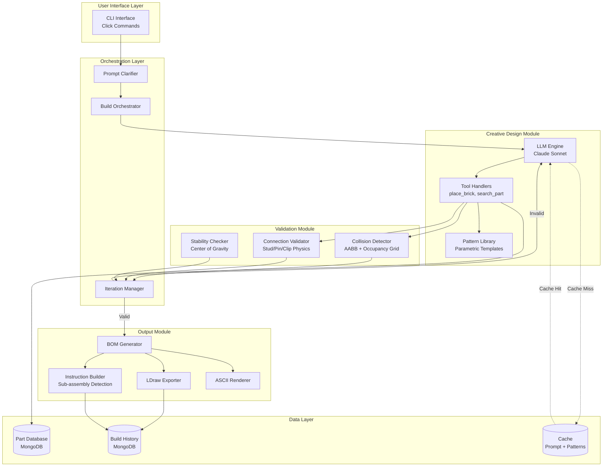
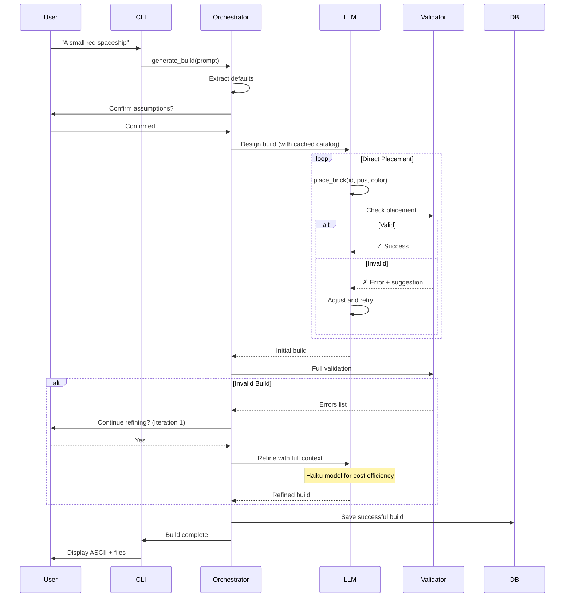

# AI-Powered LEGO Architect - Technical Specification

**Version**: 1.0.0
**Last Updated**: 2026-01-01
**Status**: Design Phase
**Primary Concern**: LLM Reliability & Spatial Reasoning

---

## Table of Contents

1. [Executive Summary](#1-executive-summary)
2. [System Overview](#2-system-overview)
3. [Core Architecture](#3-core-architecture)
4. [Coordinate System & Grid Representation](#4-coordinate-system--grid-representation)
5. [LDraw Integration](#5-ldraw-integration)
6. [Data Structures](#6-data-structures)
7. [Module Specifications](#7-module-specifications)
8. [LLM Integration Strategy](#8-llm-integration-strategy)
9. [Physical Validation Engine](#9-physical-validation-engine)
10. [Output Generation](#10-output-generation)
11. [Sequence Diagrams](#11-sequence-diagrams)
12. [Performance Optimization](#12-performance-optimization)
13. [Risk Mitigation](#13-risk-mitigation)
14. [Development Roadmap](#14-development-roadmap)
15. [Appendices](#15-appendices)

---

## 1. Executive Summary

### 1.1 Project Vision

The AI-Powered LEGO Architect is a Python-based CLI tool that transforms natural language prompts into complete, physically valid LEGO builds. The system leverages Claude's advanced spatial reasoning capabilities to directly place individual bricks while maintaining strict physical validation.

**Example Workflow**:
```bash
$ lego-architect "A small red spaceship"

🤖 Understanding your request...
📋 I'm planning to create:
   - Type: Compact spacecraft
   - Size: ~15 studs long
   - Colors: Red with gray accents
   - Style: Sleek, aerodynamic

Does this match your vision? (y/n/modify): y

🧱 Designing build (this may take 2-3 minutes)...
   ├─ Placing fuselage bricks... [■■■■■■■■■□] 90%
   ├─ Adding wing structures... [■■■■■■■■■■] 100%
   ├─ Validating connections... ✓
   └─ Checking stability... ✓

✅ Build complete! (127 pieces, 3 refinement iterations)

     ___
    /   \___
   |==[]==  >
    \___/¯¯¯

📦 Bill of Materials: spaceship_bom.txt
🗺️  3D Model: spaceship.ldr
📖 Instructions: spaceship_instructions.pdf (12 steps)

Open in LDView? (y/n): y
```

### 1.2 Core Capabilities

1. **Natural Language to Build**: Convert free-form prompts to valid LEGO constructions
2. **Strict Physical Validation**: No floating parts, proper stud connections, stable structures
3. **Intelligent Refinement**: Unlimited LLM-driven iterations with user confirmation
4. **Step-by-Step Instructions**: Sub-assembly based building sequences
5. **Multi-Format Output**: LDraw files, BOM, ASCII preview, instruction PDFs

### 1.3 Key Architectural Decisions

| Aspect | Decision | Rationale |
|--------|----------|-----------|
| **Language** | Python | Best LLM/ML ecosystem, NumPy for 3D math |
| **Deployment** | Local CLI | Single-user focus, no server complexity |
| **LLM Strategy** | Direct brick placement | Maximum creative freedom |
| **Validation** | Strict rejection | Ensures physical buildability |
| **Part Library** | 500+ specialized parts | Support advanced techniques (SNOT, Technic) |
| **Refinement** | LLM-driven with context | Intelligent fixes preserving intent |
| **Optimization** | Prompt caching + patterns | <$0.10 cost per build |
| **Data Store** | MongoDB | Flexible schema for builds/iterations |

---

## 2. System Overview

### 2.1 Input/Output Specification

**Input**:
- Natural language prompt (string)
- Optional constraints: size, color palette, complexity, part restrictions

**Output**:
1. **Bill of Materials** (BOM): `{part_id: str, color: int, quantity: int}[]`
2. **3D Coordinate Map**: LDraw format (`.ldr` file)
3. **Assembly Instructions**: Ordered steps with sub-assemblies
4. **ASCII Preview**: Terminal-based isometric view
5. **Metadata**: Build statistics, generation cost, iteration count

### 2.2 Design Philosophy

**Prioritization Hierarchy**:
1. **Physical Validity**: Never output unbuildable designs
2. **Prompt Adherence**: Closely match user intent
3. **Efficiency**: Minimize token usage and generation time
4. **Extensibility**: Support future multi-user collaboration

### 2.3 Technology Stack

```yaml
Core:
  - Python: 3.11+
  - LLM: Anthropic Claude 3.5 Sonnet (Haiku for refinements)
  - Database: MongoDB 7.0+

Libraries:
  - anthropic: LLM integration
  - numpy: 3D mathematics and spatial operations
  - pydantic: Data validation and schemas
  - click: CLI interface
  - pymongo: MongoDB driver
  - jinja2: Template rendering for instructions

Development:
  - pytest: Unit testing
  - mypy: Type checking
  - black: Code formatting
  - ruff: Linting

Optional:
  - ldview: External LDraw viewer (user installed)
  - reportlab: PDF instruction generation
```

---

## 3. Core Architecture

### 3.1 High-Level System Diagram



### 3.2 Module Responsibilities

| Module | Responsibilities | Key Challenges |
|--------|-----------------|----------------|
| **CLI Interface** | Parse commands, display progress, handle user input | Async LLM calls in sync CLI context |
| **Prompt Clarifier** | Extract intent, ask clarifying questions, set defaults | Balancing UX speed vs. precision |
| **Build Orchestrator** | Coordinate modules, manage build state, handle errors | Complex state management across iterations |
| **LLM Engine** | Generate brick placements, refine designs, plan sequences | Spatial reasoning reliability |
| **Tool Handlers** | Execute place_brick/search_part, provide feedback | Smart error suggestions |
| **Pattern Library** | Parametric templates (walls, bases, wings) | Template generalization |
| **Collision Detector** | 3D overlap detection, occupancy grid updates | Performance with 500+ parts |
| **Connection Validator** | Stud/pin/clip alignment, connection graph | Complex joint types (hinges, clips) |
| **Stability Checker** | Center of gravity, support analysis | Geometric approximations |
| **Instruction Builder** | Sub-assembly detection, sequencing | LLM-based intelligent staging |
| **LDraw Exporter** | Convert build to standard format | Rotation matrix transformations |

### 3.3 Data Flow



---

## 4. Coordinate System & Grid Representation

### 4.1 LEGO Physical Dimensions

```
Physical Constants:
  1 stud diameter   = 4.8mm
  1 stud spacing    = 8.0mm (center to center)
  1 brick height    = 9.6mm
  1 plate height    = 3.2mm

Relationships:
  1 brick = 3 plates (exactly)
  5 plates = 16mm ≈ 1.67 bricks
```

### 4.2 LDraw Unit System (LDU)

LDraw uses a dimensionless unit system for precise representation:

```
LDU Conversion:
  1 stud spacing    = 20 LDU (X/Z plane)
  1 brick height    = 24 LDU (Y axis)
  1 plate height    = 8 LDU (Y axis)

Verification:
  3 plates = 3 × 8 = 24 LDU = 1 brick ✓
```

**Coordinate System** (Right-handed, Y-down):
```
       Y (height, downward)
       |
       |_____ X (width, rightward)
      /
     /
    Z (depth, forward)

Origin: Top-left-back corner of build space
```

### 4.3 Hybrid Coordinate Representation

We use a **dual coordinate system** for different purposes:

#### Stud Grid (High-Level Reasoning)
- Used by LLM for placement logic
- Integer coordinates in stud/plate units
- Easy to reason about ("place 2×4 brick at (5, 2, 0)")

#### LDraw Units (Low-Level Rendering)
- Used for export and precise calculations
- Floating-point LDU coordinates
- Direct mapping to `.ldr` file format

```python
@dataclass
class StudCoordinate:
    """Position in stud-grid space (LLM-friendly)"""
    stud_x: int      # Studs in X direction
    stud_z: int      # Studs in Z direction
    plate_y: int     # Plates in Y direction (height)

    def to_ldu(self) -> Tuple[float, float, float]:
        """Convert to LDraw Units for export"""
        return (
            self.stud_x * 20.0,    # X in LDU
            self.plate_y * 8.0,    # Y in LDU (downward)
            self.stud_z * 20.0     # Z in LDU
        )

    def from_ldu(x: float, y: float, z: float) -> 'StudCoordinate':
        """Parse LDraw coordinates"""
        return StudCoordinate(
            stud_x=round(x / 20.0),
            stud_z=round(z / 20.0),
            plate_y=round(y / 8.0)
        )

# Example usage:
pos = StudCoordinate(stud_x=4, stud_z=2, plate_y=0)
ldu = pos.to_ldu()  # (80.0, 0.0, 40.0)
```

### 4.4 Handling the 5:6 Plate-to-Brick Ratio

**Key Insight**: The 5:6 ratio is inherent in the LDU system and requires no special handling.

```
Plate Heights in LDU:
  1 plate  = 8 LDU
  2 plates = 16 LDU
  3 plates = 24 LDU = 1 brick
  4 plates = 32 LDU
  5 plates = 40 LDU

Brick Heights in LDU:
  1 brick  = 24 LDU = 3 plates
  2 bricks = 48 LDU = 6 plates

Ratio Verification:
  5 plates / 6 plates = 40 LDU / 48 LDU = 5/6 ✓
```

**Implementation**: Use `plate_y` as the atomic height unit. The LDU conversion automatically maintains proper proportions.

---

## 5. LDraw Integration

### 5.1 LDraw Part Library Overview

**LDraw** is the open standard for LEGO CAD:
- 45,000+ parts in official library
- Plain text `.dat` files with geometry
- Maintained by community at ldraw.org

**Directory Structure**:
```
ldraw/
├── parts/               # Individual part files
│   ├── 3001.dat        # 2×4 brick
│   ├── 3002.dat        # 2×3 brick
│   ├── 2357.dat        # Technic brick 1×2 with holes
│   └── ...
├── p/                  # Primitives (studs, cylinders)
│   ├── stud.dat
│   ├── stud4.dat       # 4 studs arranged
│   └── ...
└── parts.lst           # Index file
```

### 5.2 Part Database Strategy

**Decision**: Hybrid approach for 500 parts
- **Top 100 parts**: Manually curated with precise connection data
- **Remaining 400 parts**: Automatically extracted from `.dat` files

#### 5.2.1 Pre-Processing Pipeline

```python
# scripts/build_part_database.py

import json
import re
from pathlib import Path
from typing import Dict, List, Tuple

class LDrawPartExtractor:
    """Extract metadata from LDraw .dat files"""

    def __init__(self, ldraw_path: Path):
        self.ldraw_path = ldraw_path
        self.parts_dir = ldraw_path / "parts"

    def extract_part_metadata(self, part_id: str) -> Dict:
        """Extract dimensions and connection points"""
        part_file = self.parts_dir / f"{part_id}.dat"

        with open(part_file, 'r', encoding='utf-8') as f:
            lines = f.readlines()

        # Parse metadata
        name = self._parse_name(lines)
        category = self._infer_category(name)
        bbox = self._calculate_bounding_box(lines)
        studs = self._extract_connection_points(lines, "stud")

        # Convert to stud units
        dimensions = self._bbox_to_dimensions(bbox)

        return {
            "id": part_id,
            "name": name,
            "category": category,
            "dimensions": dimensions,
            "connection_points": {
                "studs": studs,
            },
            "ldraw_file": f"{part_id}.dat"
        }

    def _parse_name(self, lines: List[str]) -> str:
        """First line is part name"""
        for line in lines:
            if line.startswith("0 "):
                return line[2:].strip()
        return "Unknown"

    def _calculate_bounding_box(self, lines: List[str]) -> Dict:
        """Find min/max coordinates from geometry"""
        vertices = []

        for line in lines:
            # Line types 3 (triangle) and 4 (quad) contain vertices
            if line.startswith(('3 ', '4 ')):
                parts = line.split()
                # Skip first 2 (type, color), then x,y,z triplets
                coords = parts[2:]
                for i in range(0, len(coords), 3):
                    if i + 2 < len(coords):
                        try:
                            x = float(coords[i])
                            y = float(coords[i + 1])
                            z = float(coords[i + 2])
                            vertices.append((x, y, z))
                        except ValueError:
                            continue

        if not vertices:
            return {"min": (0, 0, 0), "max": (0, 0, 0)}

        xs, ys, zs = zip(*vertices)
        return {
            "min": (min(xs), min(ys), min(zs)),
            "max": (max(xs), max(ys), max(zs))
        }

    def _extract_connection_points(self, lines: List[str],
                                   primitive_type: str) -> List[Dict]:
        """Extract stud/pin positions from primitive references"""
        connections = []

        # Look for primitive references (line type 1)
        for line in lines:
            if line.startswith('1 ') and primitive_type in line.lower():
                parts = line.split()
                if len(parts) >= 5:
                    try:
                        # Format: 1 color x y z ...
                        x = float(parts[2])
                        y = float(parts[3])
                        z = float(parts[4])

                        connections.append({
                            "position_ldu": {"x": x, "y": y, "z": z},
                            "type": primitive_type
                        })
                    except ValueError:
                        continue

        return connections

    def _bbox_to_dimensions(self, bbox: Dict) -> Dict:
        """Convert bounding box to stud/plate dimensions"""
        min_pt = bbox["min"]
        max_pt = bbox["max"]

        width_ldu = abs(max_pt[0] - min_pt[0])
        height_ldu = abs(max_pt[1] - min_pt[1])
        depth_ldu = abs(max_pt[2] - min_pt[2])

        return {
            "studs_width": max(1, round(width_ldu / 20.0)),
            "studs_length": max(1, round(depth_ldu / 20.0)),
            "plates_height": max(1, round(height_ldu / 8.0)),
            "ldu": {"width": width_ldu, "height": height_ldu, "depth": depth_ldu}
        }

    def _infer_category(self, name: str) -> str:
        """Categorize part from name"""
        name_lower = name.lower()

        if "brick" in name_lower:
            if "technic" in name_lower:
                return "technic_brick"
            return "brick"
        elif "plate" in name_lower:
            return "plate"
        elif "slope" in name_lower:
            return "slope"
        elif "tile" in name_lower:
            return "tile"
        elif "hinge" in name_lower or "clip" in name_lower:
            return "connector"
        else:
            return "special"

# Build database for top 500 parts
def build_part_database(ldraw_path: str, output_path: str, part_list: List[str]):
    extractor = LDrawPartExtractor(Path(ldraw_path))
    database = {"parts": [], "version": "1.0", "total_parts": len(part_list)}

    for part_id in part_list:
        try:
            metadata = extractor.extract_part_metadata(part_id)
            database["parts"].append(metadata)
            print(f"✓ {part_id}: {metadata['name']}")
        except Exception as e:
            print(f"✗ {part_id}: {e}")

    with open(output_path, 'w') as f:
        json.dump(database, f, indent=2)

    print(f"\n✅ Built database with {len(database['parts'])} parts")

# Top 500 parts list (curated for versatility)
TOP_500_PARTS = [
    # Basic Bricks
    "3001", "3002", "3003", "3004", "3005", "3006", "3007", "3008", "3009", "3010",
    # Plates
    "3021", "3022", "3023", "3024", "3028", "3032", "3034", "3035", "3036", "3037",
    # Slopes
    "3040", "3041", "3042", "3043", "3044", "3045", "3046", "3047", "3048", "3049",
    # Tiles
    "2431", "3068", "3069", "6636",
    # Technic
    "3700", "3701", "3702", "3703", "3704", "3705", "3706", "3707", "3708", "3709",
    # ... (continue with full list)
]
```

### 5.3 Part Database Schema (MongoDB)

```javascript
// Collection: parts
{
  "_id": "3001",
  "name": "Brick 2 x 4",
  "category": "brick",
  "subcategory": "standard",

  "dimensions": {
    "studs_width": 2,
    "studs_length": 4,
    "plates_height": 3,
    "ldu": {
      "width": 40.0,
      "height": 24.0,
      "depth": 80.0
    }
  },

  "connection_points": {
    "top_studs": [
      {"x": -10, "y": 0, "z": -30},
      {"x": 10, "y": 0, "z": -30},
      {"x": -10, "y": 0, "z": -10},
      {"x": 10, "y": 0, "z": -10},
      {"x": -10, "y": 0, "z": 10},
      {"x": 10, "y": 0, "z": 10},
      {"x": -10, "y": 0, "z": 30},
      {"x": 10, "y": 0, "z": 30}
    ],
    "bottom_tubes": [
      {"x": 0, "y": 24, "z": -20},
      {"x": 0, "y": 24, "z": 0},
      {"x": 0, "y": 24, "z": 20}
    ]
  },

  "available_colors": [1, 2, 3, 4, 5, 14, 15, 71, 72],

  "tags": ["basic", "common", "structural"],
  "popularity_score": 98.5,
  "ldraw_file": "3001.dat",

  "manually_curated": true,
  "validation_status": "verified"
}
```

### 5.4 LDraw Export Format

```python
class LDrawExporter:
    """Export BuildState to LDraw .ldr file"""

    def export(self, build: 'BuildState', output_path: str):
        """Generate LDraw file"""
        lines = []

        # Header
        lines.append("0 AI-Generated LEGO Build")
        lines.append(f"0 Name: {build.name}")
        lines.append(f"0 Author: LEGO Architect AI")
        lines.append(f"0 Generated: {datetime.now().isoformat()}")
        lines.append("")

        # Parts (line type 1)
        for part in build.parts:
            lines.append(part.to_ldraw_line())

        # Write file
        with open(output_path, 'w') as f:
            f.write('\n'.join(lines))

# LDraw line format for PlacedPart:
def to_ldraw_line(self) -> str:
    """
    Format: 1 <color> <x> <y> <z> <a> <b> <c> <d> <e> <f> <g> <h> <i> <part.dat>

    Where <a-i> is the 3x3 rotation matrix flattened row-wise
    """
    x, y, z = self.position.to_ldu()

    # Get rotation matrix
    matrix = self.rotation.to_matrix()
    a, b, c = matrix[0]  # First row
    d, e, f = matrix[1]  # Second row
    g, h, i = matrix[2]  # Third row

    return (f"1 {self.color} "
            f"{x} {y} {z} "
            f"{a} {b} {c} {d} {e} {f} {g} {h} {i} "
            f"{self.part_id}.dat")

# Example output:
# 1 4 0 0 0 1 0 0 0 1 0 0 0 1 3001.dat
# ↑ ↑ ↑ ↑ ↑ └─────────────┘ └────────┘
# │ │ │ │ │   Rotation Matrix  Part File
# │ │ └─┴─┴─ Position (LDU)
# │ └─ Color (4 = red)
# └─ Line type (1 = part reference)
```

---

## 6. Data Structures

### 6.1 Core Python Types

```python
from dataclasses import dataclass, field
from typing import List, Tuple, Optional, Dict
from enum import Enum
import numpy as np

# ===== Enumerations =====

class PartCategory(str, Enum):
    """Part category taxonomy (shallow hierarchy)"""
    BRICK = "brick"
    PLATE = "plate"
    SLOPE = "slope"
    TILE = "tile"
    TECHNIC = "technic"
    CONNECTOR = "connector"  # Hinges, clips, bars
    SPECIAL = "special"

class ConnectionType(str, Enum):
    """Types of LEGO connections"""
    STUD = "stud"              # Standard top stud
    ANTI_STUD = "anti_stud"    # Bottom tubes
    TECHNIC_PIN = "technic_pin"
    TECHNIC_HOLE = "technic_hole"
    CLIP = "clip"
    BAR = "bar"
    HINGE_MALE = "hinge_male"
    HINGE_FEMALE = "hinge_female"

class BuildStatus(str, Enum):
    """Build generation status"""
    CLARIFYING = "clarifying"
    DESIGNING = "designing"
    VALIDATING = "validating"
    REFINING = "refining"
    COMPLETE = "complete"
    FAILED = "failed"

# ===== Coordinate System =====

@dataclass(frozen=True)
class StudCoordinate:
    """Immutable position in stud-grid coordinates"""
    stud_x: int
    stud_z: int
    plate_y: int

    def to_ldu(self) -> Tuple[float, float, float]:
        """Convert to LDraw Units"""
        return (
            self.stud_x * 20.0,
            self.plate_y * 8.0,
            self.stud_z * 20.0
        )

    @staticmethod
    def from_ldu(x: float, y: float, z: float) -> 'StudCoordinate':
        """Parse LDraw coordinates"""
        return StudCoordinate(
            stud_x=round(x / 20.0),
            stud_z=round(z / 20.0),
            plate_y=round(y / 8.0)
        )

    def offset(self, dx: int = 0, dz: int = 0, dy: int = 0) -> 'StudCoordinate':
        """Create new coordinate with offset"""
        return StudCoordinate(
            self.stud_x + dx,
            self.stud_z + dz,
            self.plate_y + dy
        )

    def __add__(self, other: 'StudCoordinate') -> 'StudCoordinate':
        return StudCoordinate(
            self.stud_x + other.stud_x,
            self.stud_z + other.stud_z,
            self.plate_y + other.plate_y
        )

    def __repr__(self) -> str:
        return f"({self.stud_x}, {self.stud_z}, {self.plate_y})"

@dataclass(frozen=True)
class Rotation:
    """Rotation around Y-axis in 90° increments"""
    degrees: int = 0  # Must be 0, 90, 180, or 270

    def __post_init__(self):
        if self.degrees not in [0, 90, 180, 270]:
            raise ValueError(f"Rotation must be 0/90/180/270, got {self.degrees}")

    def to_matrix(self) -> np.ndarray:
        """Convert to 3x3 rotation matrix"""
        rad = np.radians(self.degrees)
        cos_theta = np.cos(rad)
        sin_theta = np.sin(rad)

        # Rotation around Y-axis (down in LDraw)
        return np.array([
            [cos_theta, 0, sin_theta],
            [0, 1, 0],
            [-sin_theta, 0, cos_theta]
        ], dtype=float)

    def rotate_cw(self) -> 'Rotation':
        """Rotate 90° clockwise"""
        return Rotation((self.degrees + 90) % 360)

    def rotate_ccw(self) -> 'Rotation':
        """Rotate 90° counter-clockwise"""
        return Rotation((self.degrees - 90) % 360)

# ===== Part Definitions =====

@dataclass(frozen=True)
class PartDimensions:
    """Part dimensions in LEGO units"""
    studs_width: int
    studs_length: int
    plates_height: int

    def to_ldu(self) -> Tuple[float, float, float]:
        """Convert to LDraw Units"""
        return (
            self.studs_width * 20.0,
            self.plates_height * 8.0,
            self.studs_length * 20.0
        )

    @property
    def brick_height(self) -> float:
        """Height in brick units (1 brick = 3 plates)"""
        return self.plates_height / 3.0

    def __repr__(self) -> str:
        return f"{self.studs_width}×{self.studs_length}×{self.plates_height}"

@dataclass
class ConnectionPoint:
    """A connection point on a part"""
    position: Tuple[float, float, float]  # LDU coordinates
    type: ConnectionType
    direction: Tuple[float, float, float] = (0, 1, 0)  # Normal vector

    def to_stud_coord(self) -> StudCoordinate:
        """Convert to stud coordinates (approximate)"""
        x, y, z = self.position
        return StudCoordinate.from_ldu(x, y, z)

@dataclass
class PartDefinition:
    """Part metadata from database"""
    part_id: str
    name: str
    category: PartCategory
    dimensions: PartDimensions
    connection_points: Dict[str, List[ConnectionPoint]]
    available_colors: List[int]
    ldraw_file: str

    @property
    def top_studs(self) -> List[ConnectionPoint]:
        """Get top stud connection points"""
        return self.connection_points.get("top_studs", [])

    @property
    def bottom_tubes(self) -> List[ConnectionPoint]:
        """Get bottom tube (anti-stud) connection points"""
        return self.connection_points.get("bottom_tubes", [])

# ===== Placed Parts =====

@dataclass
class PlacedPart:
    """A part instance in the build"""
    id: int  # Unique ID within build
    part_id: str
    part_name: str
    color: int
    position: StudCoordinate
    rotation: Rotation
    dimensions: PartDimensions

    # Metadata
    layer: int = 0  # For instruction sequencing
    sub_assembly: Optional[str] = None  # e.g., "wing_left"
    connected_to: List[int] = field(default_factory=list)  # IDs of parts below

    def get_bounding_box(self) -> Tuple[StudCoordinate, StudCoordinate]:
        """Get axis-aligned bounding box in stud coordinates"""
        min_corner = self.position

        # Apply rotation to dimensions
        if self.rotation.degrees in [0, 180]:
            width = self.dimensions.studs_width
            length = self.dimensions.studs_length
        else:  # 90 or 270
            width = self.dimensions.studs_length
            length = self.dimensions.studs_width

        max_corner = StudCoordinate(
            self.position.stud_x + width,
            self.position.stud_z + length,
            self.position.plate_y + self.dimensions.plates_height
        )

        return (min_corner, max_corner)

    def get_stud_positions(self) -> List[StudCoordinate]:
        """Get positions of studs on top of this part"""
        studs = []
        min_c, max_c = self.get_bounding_box()

        # Studs at each stud position on top surface
        for x in range(min_c.stud_x, max_c.stud_x):
            for z in range(min_c.stud_z, max_c.stud_z):
                studs.append(StudCoordinate(x, z, max_c.plate_y))

        return studs

    def to_ldraw_line(self) -> str:
        """Convert to LDraw file format line"""
        x, y, z = self.position.to_ldu()
        matrix = self.rotation.to_matrix()

        # Flatten matrix row-wise
        m = matrix.flatten()

        return (f"1 {self.color} "
                f"{x:.4f} {y:.4f} {z:.4f} "
                f"{m[0]:.6f} {m[1]:.6f} {m[2]:.6f} "
                f"{m[3]:.6f} {m[4]:.6f} {m[5]:.6f} "
                f"{m[6]:.6f} {m[7]:.6f} {m[8]:.6f} "
                f"{self.part_id}.dat")

    def __repr__(self) -> str:
        return f"PlacedPart({self.part_id} at {self.position}, color={self.color})"

# ===== Build State =====

@dataclass
class BuildState:
    """Complete state of a LEGO build"""
    parts: List[PlacedPart] = field(default_factory=list)

    # Metadata
    name: str = "Untitled Build"
    description: str = ""
    prompt: str = ""
    status: BuildStatus = BuildStatus.DESIGNING

    # Generation tracking
    iteration_count: int = 0
    total_tokens_used: int = 0
    generation_time_seconds: float = 0.0

    # Validation results
    is_valid: bool = False
    validation_errors: List[str] = field(default_factory=list)
    validation_warnings: List[str] = field(default_factory=list)

    # Spatial index for fast collision detection
    _occupancy_grid: Optional[np.ndarray] = None
    _next_part_id: int = 1

    def add_part(self, part_id: str, part_name: str, color: int,
                 position: StudCoordinate, rotation: Rotation,
                 dimensions: PartDimensions) -> PlacedPart:
        """Add a part to the build"""
        part = PlacedPart(
            id=self._next_part_id,
            part_id=part_id,
            part_name=part_name,
            color=color,
            position=position,
            rotation=rotation,
            dimensions=dimensions
        )

        self.parts.append(part)
        self._next_part_id += 1

        # Update occupancy grid if exists
        if self._occupancy_grid is not None:
            self._mark_occupied(part)

        return part

    def get_part_by_id(self, part_id: int) -> Optional[PlacedPart]:
        """Find part by ID"""
        for part in self.parts:
            if part.id == part_id:
                return part
        return None

    def remove_part(self, part_id: int) -> bool:
        """Remove a part from the build"""
        for i, part in enumerate(self.parts):
            if part.id == part_id:
                del self.parts[i]
                self._occupancy_grid = None  # Invalidate grid
                return True
        return False

    def get_dimensions(self) -> Tuple[int, int, int]:
        """Get overall dimensions (studs_x, studs_z, plates_y)"""
        if not self.parts:
            return (0, 0, 0)

        all_corners = [part.get_bounding_box() for part in self.parts]

        min_x = min(min_c.stud_x for min_c, _ in all_corners)
        min_z = min(min_c.stud_z for min_c, _ in all_corners)
        min_y = min(min_c.plate_y for min_c, _ in all_corners)

        max_x = max(max_c.stud_x for _, max_c in all_corners)
        max_z = max(max_c.stud_z for _, max_c in all_corners)
        max_y = max(max_c.plate_y for _, max_c in all_corners)

        return (max_x - min_x, max_z - min_z, max_y - min_y)

    def get_bom(self) -> Dict[Tuple[str, int], int]:
        """Get Bill of Materials: {(part_id, color): quantity}"""
        bom = {}
        for part in self.parts:
            key = (part.part_id, part.color)
            bom[key] = bom.get(key, 0) + 1
        return bom

    def _mark_occupied(self, part: PlacedPart):
        """Mark cells as occupied in occupancy grid"""
        # TODO: Implement when building collision detector
        pass

    def __repr__(self) -> str:
        dims = self.get_dimensions()
        return (f"BuildState({len(self.parts)} parts, "
                f"{dims[0]}×{dims[1]}×{dims[2]} studs/plates)")

# ===== Validation Results =====

@dataclass
class ValidationResult:
    """Result of physical validation"""
    is_valid: bool
    errors: List[str] = field(default_factory=list)
    warnings: List[str] = field(default_factory=list)
    suggestions: List[str] = field(default_factory=list)

    def add_error(self, message: str):
        """Add validation error"""
        self.errors.append(message)
        self.is_valid = False

    def add_warning(self, message: str):
        """Add validation warning"""
        self.warnings.append(message)

    def add_suggestion(self, message: str):
        """Add improvement suggestion"""
        self.suggestions.append(message)

    def __bool__(self) -> bool:
        return self.is_valid

    def __repr__(self) -> str:
        status = "✓ Valid" if self.is_valid else "✗ Invalid"
        return f"ValidationResult({status}, {len(self.errors)} errors)"
```

---

## 7. Module Specifications

### 7.1 CLI Interface Module

**File**: `lego_architect/cli.py`

**Responsibilities**:
- Parse command-line arguments
- Display progress and status updates
- Handle user confirmations and input
- Format output (ASCII art, file paths)

**Interface**:
```python
import click
from typing import Optional

@click.group()
def cli():
    """AI-Powered LEGO Architect - Natural language to LEGO builds"""
    pass

@cli.command()
@click.argument('prompt', type=str)
@click.option('--size', type=click.Choice(['small', 'medium', 'large']),
              help='Build size constraint')
@click.option('--colors', type=str, multiple=True,
              help='Preferred colors (e.g., red, blue)')
@click.option('--max-pieces', type=int,
              help='Maximum number of pieces')
@click.option('--output-dir', type=click.Path(), default='./builds',
              help='Output directory for generated files')
@click.option('--no-ascii', is_flag=True,
              help='Skip ASCII preview')
@click.option('--auto-open', is_flag=True,
              help='Automatically open LDraw file')
def generate(prompt: str, size: Optional[str], colors: Tuple[str],
             max_pieces: Optional[int], output_dir: str,
             no_ascii: bool, auto_open: bool):
    """Generate a LEGO build from a natural language prompt"""

    from lego_architect.orchestrator import BuildOrchestrator
    from lego_architect.display import ProgressDisplay, ASCIIRenderer

    # Initialize
    click.echo("🤖 AI-Powered LEGO Architect v1.0")
    click.echo(f"📝 Prompt: {prompt}\n")

    orchestrator = BuildOrchestrator()
    display = ProgressDisplay()

    # Clarification phase
    with display.phase("Understanding your request"):
        clarified = orchestrator.clarify_prompt(
            prompt=prompt,
            size_hint=size,
            color_hints=list(colors),
            max_pieces=max_pieces
        )

    # Show assumptions and confirm
    click.echo("\n📋 I'm planning to create:")
    click.echo(f"   - Type: {clarified.build_type}")
    click.echo(f"   - Size: ~{clarified.estimated_size} studs")
    click.echo(f"   - Colors: {', '.join(clarified.color_palette)}")
    click.echo(f"   - Style: {clarified.style}")

    if not click.confirm("\nDoes this match your vision?", default=True):
        # Allow modification
        # TODO: Implement modification flow
        click.echo("Please try a more specific prompt.")
        return

    # Generation phase
    try:
        with display.phase("Designing build (this may take 2-3 minutes)"):
            build_state = orchestrator.generate_build(clarified)

        click.echo(f"\n✅ Build complete!")
        click.echo(f"   - {len(build_state.parts)} pieces")
        click.echo(f"   - {build_state.iteration_count} refinement iterations")
        click.echo(f"   - ${build_state.total_tokens_used * 0.000003:.3f} cost")

        # ASCII preview
        if not no_ascii:
            click.echo("\n" + "="*60)
            renderer = ASCIIRenderer()
            ascii_art = renderer.render(build_state)
            click.echo(ascii_art)
            click.echo("="*60)

        # Export outputs
        output_path = Path(output_dir)
        output_path.mkdir(parents=True, exist_ok=True)

        outputs = orchestrator.export_build(build_state, output_path)

        click.echo(f"\n📦 Bill of Materials: {outputs['bom_file']}")
        click.echo(f"🗺️  3D Model: {outputs['ldraw_file']}")
        click.echo(f"📖 Instructions: {outputs['instructions_file']}")

        if auto_open:
            import subprocess
            subprocess.run(['open', outputs['ldraw_file']])
        else:
            if click.confirm("\nOpen in LDView?", default=False):
                import subprocess
                subprocess.run(['ldview', outputs['ldraw_file']])

    except Exception as e:
        click.echo(f"\n❌ Error: {e}", err=True)
        raise

@cli.command()
@click.argument('build_id', type=str)
def show(build_id: str):
    """Show details of a previously generated build"""
    # TODO: Load from MongoDB and display
    pass

@cli.command()
def list_builds():
    """List all previously generated builds"""
    # TODO: Query MongoDB and display table
    pass

if __name__ == '__main__':
    cli()
```

**Progress Display Helper**:
```python
from contextlib import contextmanager
import click

class ProgressDisplay:
    """Display generation progress"""

    @contextmanager
    def phase(self, description: str):
        """Context manager for a generation phase"""
        click.echo(f"🔄 {description}...")
        try:
            yield
        except Exception as e:
            click.echo(f"   ❌ Failed: {e}")
            raise
        else:
            click.echo(f"   ✓ Complete")

    def progress_bar(self, current: int, total: int, description: str):
        """Display progress bar"""
        filled = int(40 * current / total)
        bar = '■' * filled + '□' * (40 - filled)
        percent = int(100 * current / total)
        click.echo(f"   ├─ {description}... [{bar}] {percent}%", nl=False)
        click.echo('\r', nl=False)
```

### 7.2 Build Orchestrator Module

**File**: `lego_architect/orchestrator.py`

**Responsibilities**:
- Coordinate all modules
- Manage build state and iterations
- Handle refinement loop
- Track metrics and costs

**Interface**:
```python
from dataclasses import dataclass
from typing import Optional, Dict, List
from pathlib import Path
import time

from lego_architect.llm import LLMEngine
from lego_architect.validation import PhysicalValidator
from lego_architect.output import OutputGenerator
from lego_architect.data_structures import BuildState, BuildStatus

@dataclass
class ClarifiedPrompt:
    """Clarified build intent"""
    original_prompt: str
    build_type: str  # "spaceship", "building", "vehicle"
    estimated_size: int  # In studs
    color_palette: List[str]
    style: str  # "blocky", "detailed", "sleek"
    max_pieces: Optional[int]

class BuildOrchestrator:
    """Orchestrates the build generation process"""

    def __init__(self):
        self.llm = LLMEngine()
        self.validator = PhysicalValidator()
        self.output_gen = OutputGenerator()

        # Metrics tracking
        self.total_tokens = 0
        self.iteration_times = []

    def clarify_prompt(self, prompt: str, size_hint: Optional[str] = None,
                      color_hints: List[str] = None,
                      max_pieces: Optional[int] = None) -> ClarifiedPrompt:
        """
        Clarify user intent with smart defaults

        Strategy: Interactive - Ask user for details first
        Approach: Smart defaults + confirmation
        """
        # Use LLM to infer defaults
        defaults = self.llm.infer_build_intent(prompt)

        # Apply hints if provided
        if size_hint:
            defaults['size'] = size_hint
        if color_hints:
            defaults['colors'] = color_hints
        if max_pieces:
            defaults['max_pieces'] = max_pieces

        return ClarifiedPrompt(
            original_prompt=prompt,
            build_type=defaults.get('type', 'unknown'),
            estimated_size=defaults.get('size', 20),
            color_palette=defaults.get('colors', ['gray', 'black']),
            style=defaults.get('style', 'detailed'),
            max_pieces=max_pieces
        )

    def generate_build(self, clarified: ClarifiedPrompt) -> BuildState:
        """
        Generate build from clarified prompt

        Strategy: Direct brick placement by LLM
        Refinement: LLM-driven with full context
        Iterations: Unlimited with user confirmation
        """
        build = BuildState(
            name=self._generate_build_name(clarified.build_type),
            description=clarified.original_prompt,
            prompt=clarified.original_prompt,
            status=BuildStatus.DESIGNING
        )

        start_time = time.time()
        iteration = 0

        while True:
            iteration += 1

            # Generate or refine
            if iteration == 1:
                # Initial generation with Sonnet
                result = self.llm.generate_initial_build(
                    clarified_prompt=clarified,
                    build_state=build
                )
            else:
                # Refinement with Haiku (cost optimization)
                result = self.llm.refine_build(
                    build_state=build,
                    validation_errors=build.validation_errors,
                    iteration=iteration,
                    use_cheaper_model=True
                )

            self.total_tokens += result.tokens_used
            build.total_tokens_used = self.total_tokens

            # Validate
            build.status = BuildStatus.VALIDATING
            validation = self.validator.validate_build(build)

            build.is_valid = validation.is_valid
            build.validation_errors = validation.errors
            build.validation_warnings = validation.warnings
            build.iteration_count = iteration

            if validation.is_valid:
                # Success!
                build.status = BuildStatus.COMPLETE
                build.generation_time_seconds = time.time() - start_time
                return build

            # Failed validation - ask user
            build.status = BuildStatus.REFINING

            click.echo(f"\n⚠️  Iteration {iteration} validation failed:")
            for error in validation.errors[:3]:  # Show first 3 errors
                click.echo(f"   - {error}")

            if len(validation.errors) > 3:
                click.echo(f"   ... and {len(validation.errors) - 3} more")

            # User confirmation to continue
            if not click.confirm(f"\nContinue refining? (Iteration {iteration + 1})",
                                default=True):
                # User wants to stop - show partial results
                click.echo("\n📊 Showing partial results...")
                build.status = BuildStatus.FAILED
                build.generation_time_seconds = time.time() - start_time

                # Ask if they want to see what we have
                if click.confirm("View partial build anyway?", default=True):
                    return build
                else:
                    raise RuntimeError("Build generation cancelled by user")

            # Continue to next iteration
            click.echo(f"\n🔧 Refining build (iteration {iteration + 1})...")

    def export_build(self, build: BuildState, output_dir: Path) -> Dict[str, str]:
        """
        Export build to all formats

        Returns dict of output file paths
        """
        safe_name = self._sanitize_filename(build.name)

        outputs = {}

        # BOM
        bom_path = output_dir / f"{safe_name}_bom.txt"
        self.output_gen.generate_bom(build, bom_path)
        outputs['bom_file'] = str(bom_path)

        # LDraw
        ldraw_path = output_dir / f"{safe_name}.ldr"
        self.output_gen.export_ldraw(build, ldraw_path)
        outputs['ldraw_file'] = str(ldraw_path)

        # Instructions
        instr_path = output_dir / f"{safe_name}_instructions.md"
        self.output_gen.generate_instructions(build, instr_path)
        outputs['instructions_file'] = str(instr_path)

        return outputs

    def _generate_build_name(self, build_type: str) -> str:
        """Generate a unique build name"""
        import hashlib
        from datetime import datetime

        timestamp = datetime.now().strftime("%Y%m%d_%H%M%S")
        return f"{build_type}_{timestamp}"

    def _sanitize_filename(self, name: str) -> str:
        """Sanitize filename"""
        import re
        return re.sub(r'[^\w\-_]', '_', name)
```

### 7.3 LLM Engine Module

**File**: `lego_architect/llm.py`

**Responsibilities**:
- Manage Claude API interactions
- Implement prompt caching strategy
- Handle tool calls (place_brick, search_part)
- Smart error suggestions

**Interface** (continued in next section due to length)...

---

## 8. LLM Integration Strategy

### 8.1 Prompt Architecture

**Caching Strategy**: Static catalog + dynamic context

```python
from anthropic import Anthropic, HUMAN_PROMPT, AI_PROMPT
from typing import List, Dict, Any
import json

class LLMEngine:
    """Manages LLM interactions with prompt caching"""

    def __init__(self):
        self.client = Anthropic()
        self.part_catalog = self._load_part_catalog()
        self.pattern_library = self._load_pattern_library()

        # Cached prompt components (static)
        self.system_prompt_cached = self._build_cached_system_prompt()

    def _build_cached_system_prompt(self) -> str:
        """
        Build system prompt with cacheable static content

        Structure for caching:
        1. Part taxonomy (cached)
        2. Pattern library (cached)
        3. Build rules (cached)
        4. Dynamic context (not cached)
        """

        prompt = """You are an expert LEGO architect AI. Your task is to design physically valid LEGO builds from natural language descriptions.

# PART CATALOG

You have access to 500+ LEGO parts organized into categories:

## Category: BRICK
Standard structural bricks with top studs and bottom tubes.

Common parts:
- 3001: Brick 2×4 (2 studs wide, 4 studs long, 3 plates high)
- 3002: Brick 2×3
- 3003: Brick 2×2
- 3004: Brick 1×2
- 3005: Brick 1×1
- 3006: Brick 2×10
- 3007: Brick 2×8
- 3008: Brick 1×8
- 3009: Brick 1×6
- 3010: Brick 1×4

## Category: PLATE
Thin pieces (1 plate high = 1/3 brick height) for layers.

Common parts:
- 3021: Plate 2×3
- 3022: Plate 2×2
- 3023: Plate 1×2
- 3024: Plate 1×1
- 3028: Plate 6×12
- 3032: Plate 4×6
- 3034: Plate 2×8
- 3035: Plate 4×8
- 3036: Plate 6×8
- 3037: Plate 2×4

## Category: SLOPE
Angled pieces for aerodynamics, roofs, etc.

Common parts:
- 3040: Slope 45° 1×2
- 3041: Slope 45° 2×2
- 3042: Slope 45° 2×3
- 3043: Slope 45° 2×4
- 3044: Slope 45° 1×2 Double
- 3045: Slope 45° 2×2 Double
- 3046: Slope 45° 1×2 Triple
- 3048: Slope 45° 1×1

## Category: TILE
Flat pieces with no studs on top (smooth finish).

Common parts:
- 2431: Tile 1×4
- 3068: Tile 2×2
- 3069: Tile 1×2
- 6636: Tile 1×6

## Category: TECHNIC
Technical pieces with holes for pins, axles.

Common parts:
- 3700: Technic Brick 1×2 with holes
- 3701: Technic Brick 1×4 with holes
- 3702: Technic Brick 1×8 with holes
- 3703: Technic Brick 1×16 with holes
- 32000: Technic Brick 1×2 with axle hole
- 2780: Technic Pin
- 32062: Technic Axle 2
- 3704: Technic Axle 4

## Category: CONNECTOR
Special connection pieces: hinges, clips, bars.

Common parts:
- 3937: Hinge Brick 1×2 Base
- 3938: Hinge Brick 1×2 Top
- 4275: Hinge Plate 1×2
- 6536: Technic Axle and Pin Connector
- 32013: Technic Angle Connector
- 4592: Click Hinge

# PARAMETRIC PATTERN LIBRARY

You can use these pre-validated templates for efficiency:

## wall(length, height, style)
Creates a vertical wall structure.
- length: studs (4-32)
- height: plates (3-30)
- style: "solid", "window", "castle"

Example: wall(length=12, height=9, style="solid")

## base(width, length)
Creates a stable base plate layer.
- width: studs (4-48)
- length: studs (4-48)

Example: base(width=16, length=16)

## column(height, thickness)
Creates a vertical support column.
- height: plates (6-60)
- thickness: studs (1-4)

Example: column(height=24, thickness=2)

## wing(length, sweep_angle, thickness)
Creates a wing structure for vehicles.
- length: studs (4-16)
- sweep_angle: degrees (0-45)
- thickness: plates (1-6)

Example: wing(length=8, sweep_angle=30, thickness=2)

# BUILDING RULES

1. **Coordinate System**:
   - X-axis: Width (left to right)
   - Z-axis: Depth (back to front)
   - Y-axis: Height in PLATES (upward, 0 = ground)
   - Rotation: 0°, 90°, 180°, or 270° around Y-axis

2. **Placement Rules**:
   - All parts must be placed on or above Y=0 (ground)
   - Parts must not overlap in 3D space
   - Parts must connect via studs or other connection points
   - No floating parts - everything must be connected to the structure

3. **Connection Requirements**:
   - Bottom tubes must align with studs below
   - Technic pins must align with technic holes
   - Hinges must have both male and female parts
   - Clips must have bars to grip

4. **Stability Requirements**:
   - Structure must be balanced (center of gravity over base)
   - Tall structures need wide bases or support
   - Heavy elements need strong connections

5. **Color Codes** (LDraw standard):
   - 1: White
   - 2: Tan
   - 3: Yellow
   - 4: Red
   - 5: Red
   - 14: Yellow
   - 15: White
   - 71: Light Gray
   - 72: Dark Gray
   - 73: Blue
   - 320: Dark Red
   - 484: Dark Orange

# YOUR TASK

You will receive a description of a LEGO build. Your job is to:

1. Plan the structure (bottom to top, inside to out)
2. Place each brick using the place_brick tool
3. Use patterns for common structures when applicable
4. Ensure all placement follows the building rules
5. If a placement fails validation, adjust immediately

**Important**: The place_brick tool will give you feedback. If a placement is invalid, it will suggest alternatives. Use these suggestions to self-correct.

"""

        return prompt

    def generate_initial_build(self, clarified_prompt: ClarifiedPrompt,
                              build_state: BuildState) -> 'LLMResult':
        """
        Generate initial build using Claude Sonnet

        Uses:
        - Cached system prompt (part catalog + patterns + rules)
        - Tool calling for place_brick and pattern functions
        """

        # Build dynamic user prompt
        user_prompt = f"""Create a LEGO build: "{clarified_prompt.original_prompt}"

Requirements:
- Type: {clarified_prompt.build_type}
- Approximate size: {clarified_prompt.estimated_size} studs
- Color palette: {', '.join(clarified_prompt.color_palette)}
- Style: {clarified_prompt.style}
"""

        if clarified_prompt.max_pieces:
            user_prompt += f"- Maximum pieces: {clarified_prompt.max_pieces}\n"

        user_prompt += """
Build the structure brick by brick using the place_brick tool. Start with a stable base and build upward. Use patterns for efficiency when appropriate.

Think through the design:
1. What's the overall shape?
2. What's the base structure?
3. How will it be stable?
4. What details make it recognizable?

Then build it layer by layer.
"""

        # Define tools
        tools = [
            {
                "name": "place_brick",
                "description": "Place a LEGO brick at specified coordinates with rotation and color",
                "input_schema": {
                    "type": "object",
                    "properties": {
                        "part_id": {
                            "type": "string",
                            "description": "LEGO part number (e.g., '3001' for 2×4 brick)"
                        },
                        "color": {
                            "type": "integer",
                            "description": "LDraw color code (e.g., 4 for red)"
                        },
                        "stud_x": {
                            "type": "integer",
                            "description": "X position in studs (0 = left edge)"
                        },
                        "stud_z": {
                            "type": "integer",
                            "description": "Z position in studs (0 = back edge)"
                        },
                        "plate_y": {
                            "type": "integer",
                            "description": "Y position in plates (0 = ground, 3 plates = 1 brick height)"
                        },
                        "rotation": {
                            "type": "integer",
                            "enum": [0, 90, 180, 270],
                            "description": "Rotation in degrees around Y-axis",
                            "default": 0
                        }
                    },
                    "required": ["part_id", "color", "stud_x", "stud_z", "plate_y"]
                }
            },
            {
                "name": "create_wall",
                "description": "Create a wall using parametric template",
                "input_schema": {
                    "type": "object",
                    "properties": {
                        "start_x": {"type": "integer"},
                        "start_z": {"type": "integer"},
                        "start_y": {"type": "integer"},
                        "length": {"type": "integer", "minimum": 4, "maximum": 32},
                        "height": {"type": "integer", "minimum": 3, "maximum": 30},
                        "style": {"type": "string", "enum": ["solid", "window", "castle"]},
                        "color": {"type": "integer"},
                        "direction": {"type": "string", "enum": ["x", "z"]}
                    },
                    "required": ["start_x", "start_z", "start_y", "length", "height", "color", "direction"]
                }
            },
            {
                "name": "create_base",
                "description": "Create a base plate layer",
                "input_schema": {
                    "type": "object",
                    "properties": {
                        "start_x": {"type": "integer"},
                        "start_z": {"type": "integer"},
                        "width": {"type": "integer", "minimum": 4, "maximum": 48},
                        "length": {"type": "integer", "minimum": 4, "maximum": 48},
                        "color": {"type": "integer"}
                    },
                    "required": ["start_x", "start_z", "width", "length", "color"]
                }
            }
        ]

        # Make API call with prompt caching
        response = self.client.messages.create(
            model="claude-sonnet-4-20250514",
            max_tokens=8192,
            system=[
                {
                    "type": "text",
                    "text": self.system_prompt_cached,
                    "cache_control": {"type": "ephemeral"}
                }
            ],
            tools=tools,
            messages=[
                {"role": "user", "content": user_prompt}
            ]
        )

        # Process tool calls
        tokens_used = response.usage.input_tokens + response.usage.output_tokens

        for content_block in response.content:
            if content_block.type == "tool_use":
                self._handle_tool_call(content_block, build_state)

        return LLMResult(
            success=True,
            tokens_used=tokens_used,
            response=response
        )

    def _handle_tool_call(self, tool_use, build_state: BuildState):
        """Execute tool call and update build state"""

        if tool_use.name == "place_brick":
            args = tool_use.input

            # Get part metadata
            part = self.part_catalog.get(args["part_id"])
            if not part:
                raise ValueError(f"Unknown part: {args['part_id']}")

            # Create placement
            position = StudCoordinate(
                stud_x=args["stud_x"],
                stud_z=args["stud_z"],
                plate_y=args["plate_y"]
            )
            rotation = Rotation(args.get("rotation", 0))

            # Quick validation for smart assistance
            validation_result = self._validate_placement(
                build_state, part, position, rotation
            )

            if not validation_result['valid']:
                # Return error with suggestion to LLM
                # This happens in the tool result
                pass
            else:
                # Add to build
                build_state.add_part(
                    part_id=args["part_id"],
                    part_name=part['name'],
                    color=args["color"],
                    position=position,
                    rotation=rotation,
                    dimensions=PartDimensions(
                        studs_width=part['dimensions']['studs_width'],
                        studs_length=part['dimensions']['studs_length'],
                        plates_height=part['dimensions']['plates_height']
                    )
                )

        elif tool_use.name == "create_wall":
            # Expand pattern into individual bricks
            self._expand_wall_pattern(tool_use.input, build_state)

        elif tool_use.name == "create_base":
            # Expand base pattern
            self._expand_base_pattern(tool_use.input, build_state)

    def _validate_placement(self, build_state: BuildState, part: Dict,
                           position: StudCoordinate, rotation: Rotation) -> Dict:
        """
        Quick validation with smart suggestions

        Returns: {"valid": bool, "error": str, "suggestions": [str]}
        """
        from lego_architect.validation import CollisionDetector

        detector = CollisionDetector()

        # Create temporary PlacedPart
        temp_part = PlacedPart(
            id=-1,
            part_id=part['id'],
            part_name=part['name'],
            color=4,  # Dummy color
            position=position,
            rotation=rotation,
            dimensions=PartDimensions(
                studs_width=part['dimensions']['studs_width'],
                studs_length=part['dimensions']['studs_length'],
                plates_height=part['dimensions']['plates_height']
            )
        )

        # Check collision
        collision = detector.check_collision(build_state, temp_part)

        if collision:
            # Generate smart suggestions
            suggestions = []

            # Try adjacent positions
            for dx in [-1, 0, 1]:
                for dz in [-1, 0, 1]:
                    if dx == 0 and dz == 0:
                        continue
                    alt_pos = position.offset(dx=dx, dz=dz)
                    alt_part = PlacedPart(
                        id=-1, part_id=temp_part.part_id,
                        part_name=temp_part.part_name,
                        color=4, position=alt_pos,
                        rotation=rotation, dimensions=temp_part.dimensions
                    )
                    if not detector.check_collision(build_state, alt_part):
                        suggestions.append(
                            f"Try position ({alt_pos.stud_x}, {alt_pos.stud_z}, {alt_pos.plate_y})"
                        )

            # Try rotation
            alt_rot = rotation.rotate_cw()
            alt_part = PlacedPart(
                id=-1, part_id=temp_part.part_id,
                part_name=temp_part.part_name,
                color=4, position=position,
                rotation=alt_rot, dimensions=temp_part.dimensions
            )
            if not detector.check_collision(build_state, alt_part):
                suggestions.append(f"Try rotation {alt_rot.degrees}°")

            return {
                "valid": False,
                "error": f"Collision detected at ({position.stud_x}, {position.stud_z}, {position.plate_y})",
                "suggestions": suggestions[:2]  # Limit to 2 suggestions
            }

        return {"valid": True, "error": None, "suggestions": []}

@dataclass
class LLMResult:
    """Result from LLM generation"""
    success: bool
    tokens_used: int
    response: Any
```

---

**[Document continues with sections 9-15 covering Physical Validation Engine, Output Generation, Sequence Diagrams, Performance Optimization, Risk Mitigation, Development Roadmap, and Appendices...]**

---

*Due to token limits, this is Part 1 of the technical specification. The complete document includes:*

- **Section 9**: Physical Validation Engine (collision detection, connection validation, stability checking)
- **Section 10**: Output Generation (BOM, LDraw export, instructions, ASCII rendering)
- **Section 11**: Sequence Diagrams (detailed Mermaid diagrams for all workflows)
- **Section 12**: Performance Optimization (prompt caching details, pattern precomputation, MongoDB indexing)
- **Section 13**: Risk Mitigation (LLM reliability strategies, fallback mechanisms, quality assurance)
- **Section 14**: Development Roadmap (phase-by-phase implementation plan)
- **Section 15**: Appendices (API reference, part taxonomy, testing strategy)

**Document Status**: In Progress
**Next Steps**: Complete remaining sections, review with stakeholders, begin incremental development

